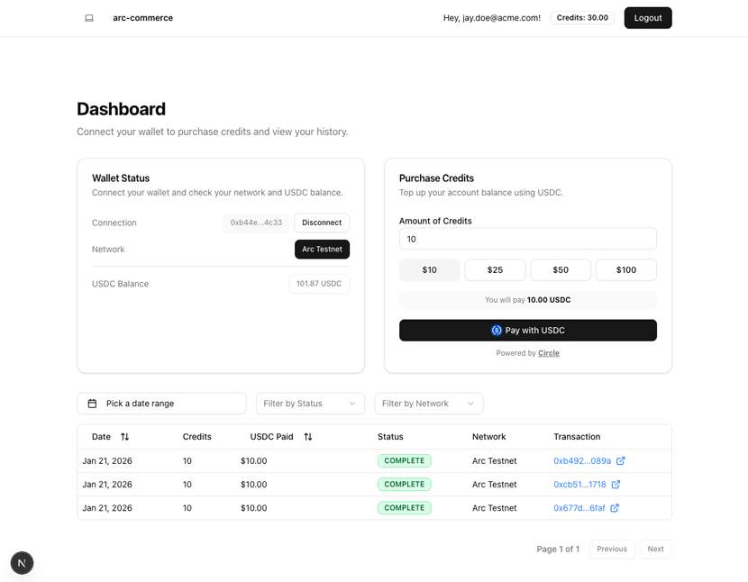

# Arc Commerce

Integrate USDC as a payment method for purchasing credits on Arc. This sample application uses Next.js, Supabase, and Circle Developer Controlled Wallets to demonstrate a credit purchase flow with USDC payments on Arc testnet.



## Table of Contents

- [Prerequisites](#prerequisites)
- [Clone and Run Locally](#clone-and-run-locally)
- [Environment Variables](#environment-variables)
- [User Accounts](#user-accounts)

## Prerequisites

- **Node.js v22+** — Install via [nvm](https://github.com/nvm-sh/nvm) (`nvm use` will read the `.nvmrc` file)
- **Supabase CLI** — Install via `npm install -g supabase` or see [Supabase CLI docs](https://supabase.com/docs/guides/cli/getting-started)
- **Docker Desktop** (only if using the local Supabase path) — [Install Docker Desktop](https://www.docker.com/products/docker-desktop/)
- **[ngrok](https://ngrok.com/)** - for local webhook testing)
- Circle Developer Controlled Wallets **[API key](https://console.circle.com/signin)** and **[Entity Secret](https://developers.circle.com/wallets/dev-controlled/register-entity-secret)**

## Getting Started

1. Clone the repository and install dependencies:

   ```bash
   git clone git@github.com:circlefin/arc-commerce.git
   cd arc-commerce
   npm install
   ```

2. Set up the database — Choose one of the two paths below:

   <details>
   <summary><strong>Path 1: Local Supabase (Docker)</strong></summary>

   Requires Docker Desktop installed and running.

   ```bash
   npx supabase start
   npx supabase migration up
   ```

   The output of `npx supabase start` will display the Supabase URL and API keys needed in the next step.

   </details>

   <details>
   <summary><strong>Path 2: Remote Supabase (Cloud)</strong></summary>

   Requires a [Supabase](https://supabase.com/) account and project.

   ```bash
   npx supabase link --project-ref <your-project-ref>
   npx supabase db push
   ```

   Retrieve your project URL and API keys from the Supabase dashboard under **Settings → API**.

   </details>

3. Set up environment variables:

   ```bash
   cp .env.example .env.local
   ```

   Then edit `.env.local` and fill in all required values. Use the Supabase URL and keys from the previous step's output (see [Environment Variables](#environment-variables) section below).

4. Start the development server:

   ```bash
   npm run dev
   ```

   The app will be available at `http://localhost:3000`. The admin wallet is automatically created on first startup.

5. Set up Circle Webhooks (for local development):

   In a separate terminal, expose your local server:

   ```bash
   ngrok http 3000
   ```

   Copy the HTTPS URL from ngrok (e.g., `https://your-ngrok-url.ngrok.io`) and add it to your Circle Console webhooks section:
   - Navigate to Circle Console → Webhooks
   - Add a new webhook endpoint: `https://your-ngrok-url.ngrok.io/api/circle/webhook`
   - Keep ngrok running while developing to receive webhook events

## How It Works

- Built with [Next.js](https://nextjs.org/) and [Supabase](https://supabase.com/)
- Uses [Circle Developer Controlled Wallets](https://developers.circle.com/wallets/dev-controlled) for USDC transactions
- Wallet operations handled server-side with `@circle-fin/developer-controlled-wallets`
- Webhook signature verification ensures secure transaction notifications
- Admin wallet automatically initialized on first run

## Environment Variables

Copy `.env.example` to `.env.local` and fill in the required values:

```bash
# Supabase
NEXT_PUBLIC_SUPABASE_URL=
NEXT_PUBLIC_SUPABASE_PUBLISHABLE_OR_ANON_KEY=
SUPABASE_SECRET_KEY=

# Circle
CIRCLE_API_KEY=
CIRCLE_ENTITY_SECRET=
CIRCLE_BLOCKCHAIN=ARC-TESTNET
CIRCLE_USDC_TOKEN_ID=

# Misc
ADMIN_EMAIL=admin@admin.com
```

| Variable                              | Scope       | Purpose                                                                  |
| ------------------------------------- | ----------- | ------------------------------------------------------------------------ |
| `NEXT_PUBLIC_SUPABASE_URL`            | Public      | Supabase project URL.                                                    |
| `NEXT_PUBLIC_SUPABASE_PUBLISHABLE_OR_ANON_KEY` | Public | Supabase anonymous/public key.                                           |
| `SUPABASE_SECRET_KEY`           | Server-side | Secret key for privileged writes (e.g., transaction inserts).                  |
| `CIRCLE_API_KEY`                      | Server-side | Used to fetch Circle webhook public keys for signature verification.     |
| `CIRCLE_ENTITY_SECRET`                | Server-side | Circle entity secret for wallet operations.                              |
| `CIRCLE_BLOCKCHAIN`                   | Server-side | Blockchain network identifier (e.g., "ARC-TESTNET").                     |
| `CIRCLE_USDC_TOKEN_ID`                | Server-side | USDC token ID for the specified blockchain. Pre-filled for ARC-TESTNET.  |
| `ADMIN_EMAIL`                         | Server-side | Admin user email address.                                                |

## User Accounts

### Admin Account

On first startup, an admin user is automatically created with the following credentials:

- **Email:** `admin@admin.com`
- **Password:** `123456`

The admin account has access to the **Admin Dashboard**, which provides an overview of all users, wallets, and transactions in the system.

Regular users who sign up will see the **User Dashboard**, which allows them to purchase credits with USDC and view their own transaction history.

### Signup Rate Limits

Supabase limits email signups to **2 per hour** by default (unless custom SMTP is configured). If you hit an "email rate limit exceeded" error during testing:

- **Local Supabase (Docker):** Email verification is handled by the built-in [Inbucket](http://127.0.0.1:54324) mail server — check it to confirm signups. The rate limit can be adjusted in `supabase/config.toml` under `[auth.rate_limit]`.
- **Remote Supabase (Cloud):** Use real email addresses (disposable emails may fail verification). If you hit the limit, you can manually add users via the Supabase dashboard under **Authentication → Users**.
- `npm run dev`: Start Next.js development server with auto-reload
- `npx supabase start`: Start local Supabase instance
- `npx supabase migration up`: Apply database migrations

## Security & Usage Model

This sample application:
- Assumes testnet usage only
- Handles secrets via environment variables
- Verifies webhook signatures for security
- Is not intended for production use without modification

See `SECURITY.md` for vulnerability reporting guidelines. Please report issues privately via Circle's bug bounty program.
